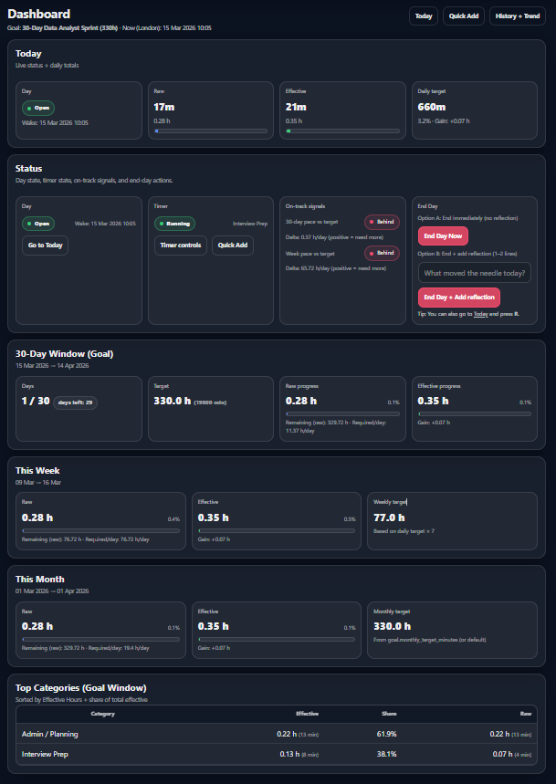
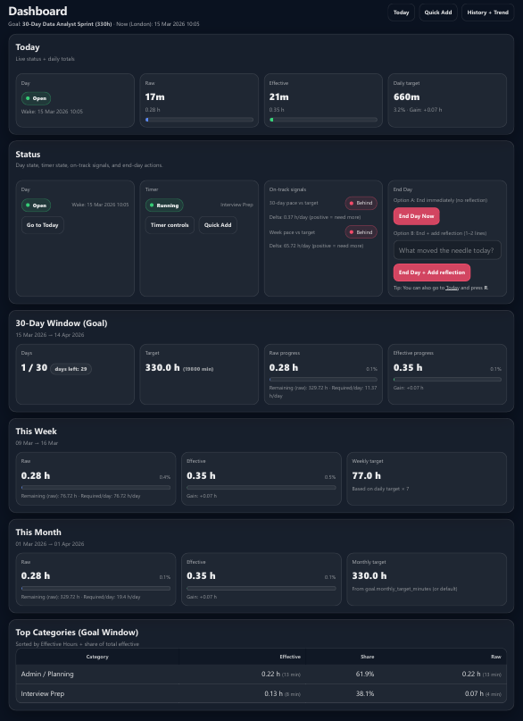

# GoalTracker — KPI Tracking & BI Reporting

> **Session data → quality-weighted KPIs → snapshot reporting → BI-ready outputs**

[](https://www.python.org/)
[](https://www.djangoproject.com/)
[](https://powerbi.microsoft.com/)


---

## Overview

**GoalTracker** is a KPI-first analytics and BI/reporting project that turns session-level operational activity into weighted performance metrics, persisted snapshot summaries, and reporting-oriented outputs.

The project is designed to show how raw work logs can become business-facing reporting surfaces — outputs that an analyst, reporting team, or manager can act on directly.

This public repository is intentionally a **showcase version**. It focuses on:

- what the project proves
- how the KPI model works
- what a reviewer should look at first
- screenshots of the main reporting surfaces

It does **not** include the full private source code.

---

## What This Project Is — and Is Not

Most time-tracking tools stop at logging hours. **GoalTracker starts there and goes further.**

It is a **KPI-first analytics and reporting project** built to demonstrate how raw operational activity becomes a business-interpretable metric — and how that metric can be delivered through dashboards, snapshots, exports, and BI-oriented reporting.

It is **not** positioned as:

| ✗ What it is not | ✓ What it is |
|---|---|
| A habit tracker | A KPI modelling project |
| A task manager | A snapshot reporting system |
| A generic CRUD app | A BI-oriented reporting pipeline |
| A personal productivity toy | A portfolio proof of analytical thinking |

---

## Core KPI — Effective Minutes

The idea that differentiates GoalTracker from a basic time logger is **effective minutes**.

Not all logged time is treated as equally valuable. A session completed at higher quality contributes more to performance than the same duration at lower quality.

```
Effective Minutes = Raw Duration × Quality Multiplier
```

This quality-weighted metric drives the project's entire reporting model: session analysis, snapshot summaries, attainment calculations, and dashboard outputs.

→ See [`docs/kpi-definitions.md`](docs/kpi-definitions.md) for the full KPI glossary.

---

## What This Project Demonstrates

| Capability | Evidence |
|---|---|
| **KPI modelling** | Session data converted into raw minutes and quality-weighted effective minutes |
| **Snapshot reporting** | Daily and weekly summaries persisted as reporting outputs, not recalculated at read time |
| **Target vs actual analysis** | Dashboard and snapshot views show attainment against configured targets |
| **Reporting-oriented export design** | Export layer structured to support downstream spreadsheet and Power BI analysis |
| **Reporting workflow design** | Structured CSV delivery with a v2 BI-friendly export layer |
| **Manager-friendly interpretation** | Ratings, attainment %, and summaries convert raw records into decision-useful outputs |
| **End-to-end proof** | Dashboard screenshots, snapshot views, export proof, and Power BI screenshots included |

---

## KPI Summary

| Metric | Definition |
|---|---|
| **Raw Minutes** | Unweighted logged time |
| **Effective Minutes** | Quality-weighted time — the project's primary KPI |
| **Target Minutes** | Configured benchmark for performance comparison |
| **Attainment %** | Progress against target |
| **Rating** | Business-friendly performance label (Behind / Good / Better / Excellent) |
| **MAE Block** | Morning / Afternoon / Evening work distribution |

→ See [`docs/kpi-definitions.md`](docs/kpi-definitions.md) for full definitions and calculation logic.

---

## Reporting Model

GoalTracker moves data through four layers:

```
Operational input    →    KPI logic    →    Snapshot layer    →    Delivery layer
(sessions, timer)        (weighting,        (daily + weekly        (dashboard,
                          attainment)        persisted)             exports, BI)
```

| Layer | What happens |
|---|---|
| **Operational input** | Sessions captured via timer-driven workflow with quality-level tagging |
| **KPI logic** | Raw minutes transformed into effective minutes, attainment, and rating |
| **Snapshot layer** | Day and week summaries persisted for historical review and trend analysis |
| **Delivery layer** | Dashboard outputs, snapshot views, export files, and Power BI reporting |

---

## Export & BI Positioning

The export layer demonstrates a shift from *"download a report"* to *"publish a structured reporting dataset."*

GoalTracker includes:

- **Legacy CSV exports** — for direct review and quick inspection
- **v2 BI-oriented exports** — structured with reporting consumers in mind, separating fact-level activity from summary outputs
- **Power BI reporting proof** — downstream use of the export dataset, shown in the dashboard screenshot

This is one of the project's strongest proof areas for BI and Reporting roles.

---

## Review Order

If you are reviewing this project quickly, focus on these in order:

| # | Surface | What to notice |
|---|---|---|
| 1 | **KPI Dashboard** | Headline metrics, target vs actual progress, raw vs effective minutes |
| 2 | **Snapshot History** | Persisted reporting outputs and trend visibility across time |
| 3 | **Day Snapshot Detail** | How attainment and rating are surfaced at the day level |
| 4 | **Export Hub** | How reporting outputs are structured for downstream use |
| 5 | **Power BI Dashboard** | Evidence of BI-facing reporting consumption |

→ See [`docs/proof/PROOF_INDEX.md`](docs/proof/PROOF_INDEX.md) for the full proof guide.

---

## Screenshots

The screenshots below show the project's main proof surfaces: KPI reporting, snapshot history, export delivery, and downstream Power BI analysis.

### 1 — KPI Dashboard
Target vs actual progress, raw vs effective minutes, goal-window pacing, and category breakdown.



### 2 — Daily Tracking Workflow
Active day lifecycle, timer-driven capture, quality-level input, and the session log that feeds the KPI model.


### 3 — Snapshot History
Trend view, daily and weekly history, and category contribution analysis across the goal window.


### 4 — Day Snapshot Detail
Persisted daily summary showing attainment, rating, and supporting session records.


### 5 — Export Hub
Reporting-oriented CSV outputs including the v2 BI-friendly export structure.


### 6 — Power BI Dashboard (Premium Dark)
SaaS-grade dark theme layout with KPI strip, Core Overview (bar chart + donut), Sprint Tracker (cumulative line chart), Deep Analysis (histogram + scatter + efficiency bars), and Hire Manager summary panel.



---

## Role Fit

| Role | Why this project is relevant |
|---|---|
| **BI Analyst** | KPI definitions, snapshot reporting, dashboard outputs, reporting-oriented export design |
| **Data Analyst** | Target vs actual analysis, category breakdowns, weighted performance modelling |
| **Reporting Analyst** | Recurring summaries, export delivery, manager-facing interpretation |
| **Analytics Engineer** | Structured metric logic, persisted snapshot layer, reporting-ready dataset design |

---

## Portfolio Context

GoalTracker is the fourth flagship project in a portfolio built to demonstrate capability across four distinct data categories:

| Project | Data category | Primary focus |
|---|---|---|
| CineScope Analytics | Event / activity data | ETL pipeline, engagement analytics, KPI dashboard |
| DataBridge Market API | External / API-driven data | Multi-source ingestion, normalised storage, operational visibility |
| PureLaka Commerce Platform | Transactional business data | Commerce analytics, reporting, operational monitoring |
| **GoalTracker** | Internal performance data | KPI modelling, snapshot reporting, BI-ready export design |

Together, the four projects demonstrate analytical capability across event data, external/API data, transactional business data, and KPI-driven reporting model design.

---

## Interview Narrative

> *"I built a KPI-first reporting project that captures session-level work activity, applies quality-weighted logic to produce an effective-minutes KPI, persists day and week snapshot summaries, and publishes reporting-oriented outputs for downstream BI analysis. The goal was not just to log time — it was to model operational performance in a way that an analyst, reporting team, or manager could interpret and act on."*

---

## Code Availability

This public repository is a **showcase version** created for recruiter and portfolio review.

The full implementation is maintained in a separate private repository so the project's KPI model, reporting logic, export design, and BI-facing outputs can be presented publicly without exposing the full codebase.

Implementation walkthrough is available during recruiter or hiring-manager conversations where appropriate.

---

## Notes

- This showcase repo is intended for portfolio and recruiter review.
- Screenshots are the primary public proof surface.
- The Power BI file is not publicly distributed in this showcase version.
- Full implementation is retained privately.

---

> **License notice:** No license has been added to this repository. Add a `LICENSE` file before making it publicly reusable.
